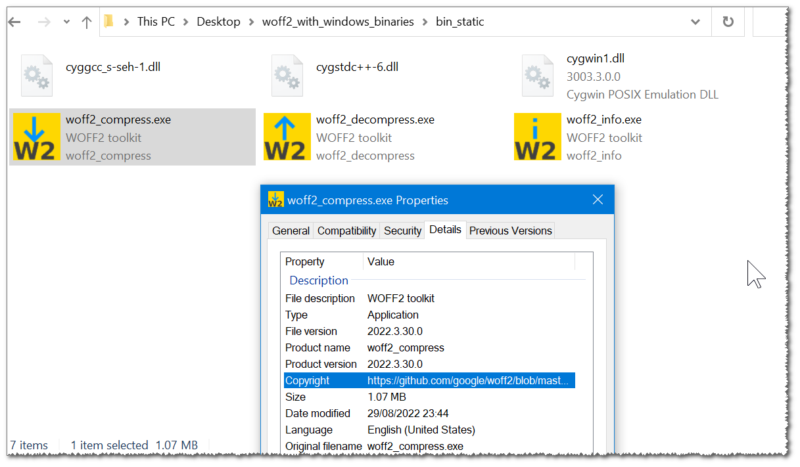

WOFF2 with Windows Binaries

  

there are some builds for Windows from cygwin  
https://mirror.isoc.org.il/pub/cygwin/x86_64/release/woff2  
with adding few cygwin dlls to the same folder you can run it under windows pretty fine,  
they do take quite a long time to execute for some reason.  

this is a build match to head of the repository from 2022.03.30,  
https://github.com/google/woff2/commit/4721483ad780ee2b63cb787bfee4aa64b61a0446  
source, x64 (amd64) binaries for Windows included, both static and dynamic.  

all dependencies are included, both cygwin's,  
and the brotli dlls needed for the dynamic variation.  

it is best to use the static variation,  
which only requires cygwin dlls in the same folder,  
it is slightly faster too.  

manifest, icon, version info  
were also embedded into the exe files using https://github.com/eladkarako/manifest and ResourceHacker.  
I also included res and rc if you wish to include them into the make file.  

 
 

